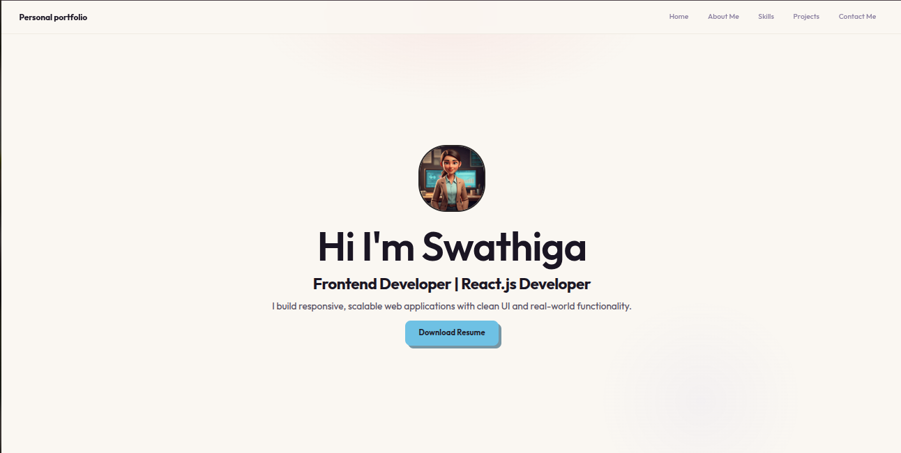
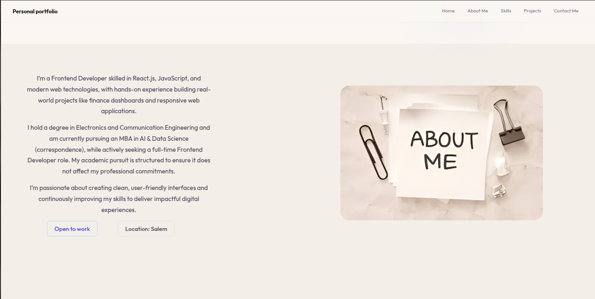
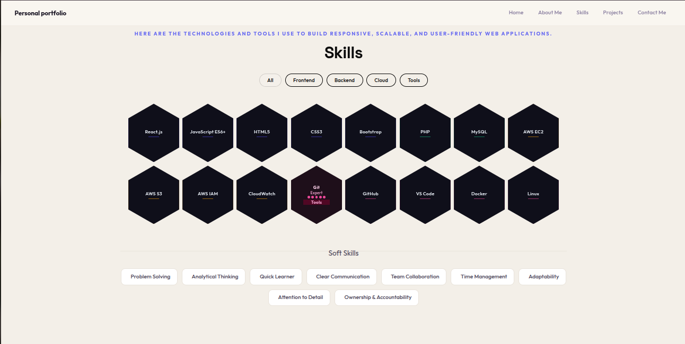
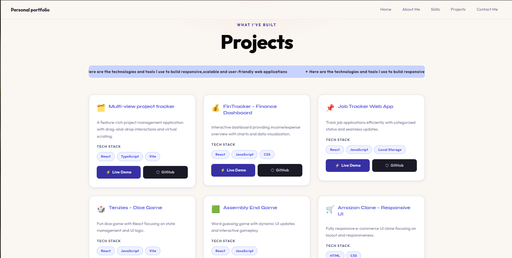
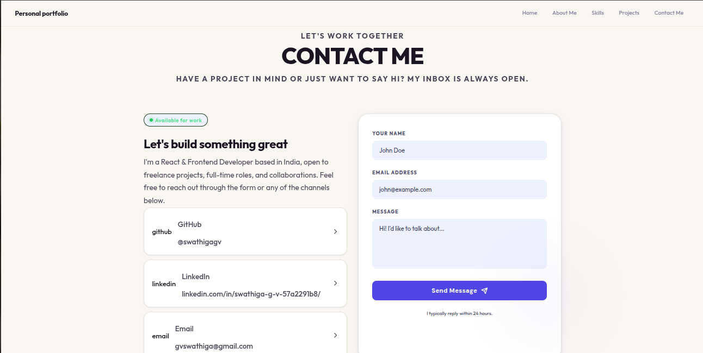

# 🌐 Personal Portfolio — Swathiga

> A fully responsive personal portfolio website built with **React.js**, showcasing my skills, projects, and professional background as a Frontend Developer.

---

## 🔗 Live Demo

[](https://your-portfolio-url.com)
[](https://linkedin.com/in/yourname)
[](https://github.com/yourusername)

---

## 📸 Preview

🔹 Home page
<p align="center">  </p>
🔹 About page
<p align="center">  </p>
🔹 Skills page (interactive)
<p align="center">  </p>
🔹 Project page (interactive)
<p align="center">  </p>
🔹 Contact me page
<p align="center">  </p>


---

## 👩‍💻 About

I am **Swathiga**, a Frontend Developer specializing in **React.js** and modern web technologies. I build responsive, scalable web applications with clean UI and real-world functionality.

- 🎓 B.E. in Electronics & Communication Engineering
- 📚 Pursuing MBA in AI & Data Science *(correspondence)*
- 📍 Based in Salem, Tamil Nadu, India
- 💼 Open to full-time Frontend Developer roles & freelance projects

---

## ✨ Features

- ⚛️ Built entirely with **React.js** (functional components + hooks)
- 🎨 Light-themed design with **warm cream + indigo** color palette
- 📱 Fully **responsive** across mobile, tablet, and desktop
- 🔷 Interactive **hexagonal skills grid** with flip animations and category filters
- 🗂️ **Projects section** with live demo & GitHub links per project
- 📬 **Contact form** with form state management (sending / sent / error)
- 🌀 Scroll-triggered animations and smooth section transitions
- 🧩 Modular component architecture with a unified global CSS system

---

## 🛠️ Tech Stack

| Category   | Technologies                              |
|------------|-------------------------------------------|
| Frontend   | React.js, JavaScript (ES6+), HTML5, CSS3 |
| Styling    | CSS Modules, Custom Global CSS, Bootstrap |
| Backend    | PHP, MySQL                                |
| Cloud      | AWS EC2, S3, IAM, CloudWatch              |
| Tools      | Git, GitHub, VS Code, Docker, Linux       |
| Build Tool | Vite                                      |

---

## 📁 Project Structure

```
src/
├── components/
│   ├── Navbar.jsx
│   ├── HeroSection.jsx
│   ├── AboutSection.jsx
│   ├── SkillsSection.jsx
│   ├── ProjectsSection.jsx
│   ├── ProjectCard.jsx
│   └── ContactSection.jsx
├── data/
│   ├── projectdata.js
│   └── contactdata.js
├── global.css
└── main.jsx
```

---

## 🚀 Projects Showcased

### 1. 🗂️ Multi-View Project Tracker
A feature-rich project management application built with React and TypeScript. Supports multiple views, drag-and-drop interactions, and virtual scrolling for large datasets.

`React` `TypeScript` `Vite`

---

### 2. 💰 FinTracker – Finance Dashboard
An interactive finance dashboard developed as a frontend assessment project. Provides a clear income/expense overview with data visualization and a clean responsive UI.

`React` `JavaScript` `CSS`

---

### 3. 📌 Job Tracker Web App
A practical web app to manage job applications — track status, manage deadlines, and organize job details with persistent local storage support.

`React` `JavaScript` `Local Storage`

---

### 4. 🎲 Tenzies – Interactive Dice Game
A fun dice game where users roll and lock dice to match numbers. Focused on smooth state management and interactive UI experience.

`React` `JavaScript` `Vite`

---

### 5. 🟩 Assembly End Game
A word-guessing game inspired by Hangman with a programming theme. Features dynamic UI updates and limited-attempt gameplay logic.

`React` `JavaScript`

---

### 6. 🛒 Amazon Clone – Responsive UI
A fully responsive e-commerce homepage clone built with HTML and CSS. Focused on layout design, responsiveness, and replicating real-world UI structure.

`HTML` `CSS`

---

## ⚙️ Getting Started

To run this project locally:

```bash
# 1. Clone the repository
git clone https://github.com/yourusername/portfolio.git

# 2. Navigate into the project directory
cd portfolio

# 3. Install dependencies
npm install

# 4. Start the development server
npm run dev
```

Then open [http://localhost:5173](http://localhost:5173) in your browser.

---

## 📦 Build for Production

```bash
npm run build
```

The optimized output will be in the `dist/` folder, ready for deployment on **Vercel**, **Netlify**, or **GitHub Pages**.

---

## 📬 Contact

Have a project in mind or want to connect?

- 📧 **Email:** gvswathiga@gmail.com
- 💼 **LinkedIn:** [linkedin.com/in/swathiga-g-v-57a2291b8](https://linkedin.com/in/swathiga-g-v-57a2291b8/)
- 🐙 **GitHub:** [github.com/swathigagv](https://github.com/swathigagv)

---

## 📄 License

This project is open source and available under the [MIT License](./LICENSE).

---


<p align="center">
  Designed & Developed with ❤️ by <strong>Swathiga</strong>
</p>
